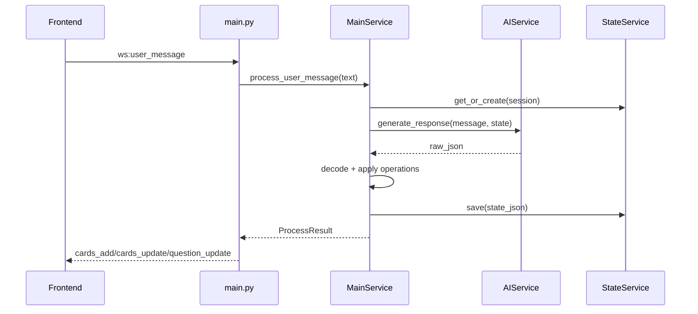

# Clarify Board - Architecture

Last updated: 2026-03-05

Execution plan for architecture work: `ARCHITECTURE_PLAN.md`.

## 1) System Overview

Clarify Board is a realtime collaborative-thinking app with AI assistance.

- Frontend: Svelte 5 + TypeScript
- Backend: FastAPI + WebSocket + REST
- Storage: SQLite (single `sessions` table with JSON state blob)
- AI: OpenRouter (chat completions via OpenAI-compatible SDK)
- Optional AI feature: OpenAI Whisper transcription endpoint

## 2) Runtime Components

## Backend

- `backend/app/main.py`
  - WebSocket transport (`/ws`)
  - REST endpoints (`/api/health`, `/api/sessions`, `/api/transcribe`)
  - Auth guard wiring
- `backend/app/services/main_service.py`
  - Per-connection orchestration
  - Session lifecycle, card/connection mutations, phase progression
- `backend/app/services/state_service.py`
  - SQLite persistence (load/save/list/delete)
  - JSON serialization/deserialization of full session state
- `backend/app/services/ai_service.py`
  - Prompting and LLM response generation
- `backend/app/services/decoder.py`
  - Converts raw AI JSON to validated internal operations
- `backend/app/services/special_questions.py`
  - Curated locale-aware special questions
- `backend/app/construct.py`
  - Dependency injection and environment setup

## Frontend

- Svelte stores orchestrate auth, websocket, cards, boards, selection, i18n, onboarding
- Main interaction model is realtime over `/ws`
- Boards/session management uses REST + websocket hydration

## 3) Data Model (Core)

Defined in `backend/app/models.py`.

- `State`
  - `session_id`, `user_id`, `locale`
  - `question`, `phase`, `current_question`, `current_hint`, `phase_index`
  - `cards: Card[]`
  - `connections: Connection[]`
  - `pending_special_question`
  - `special_questions_history`
- `Card`
  - normalized coordinates `x` and `y` in range `0..1`
  - type: `question|fact|pain|resource|hypothesis|todo`
  - editable content and visual params
- `Connection`
  - `from_id`, `to_id`, `type`, `label`, `strength`

## 4) Persistence Model

`StateService` stores each session as one JSON blob in SQLite.

Table: `sessions`

- `id` (PK)
- `user_id`
- `title`
- `state_json`
- `created_at`
- `updated_at`

Design choice:

- + Fast to evolve state shape without frequent SQL schema changes
- - Harder to query analytics directly from SQL

## 5) Protocol Surface

## WebSocket Client -> Server message types

- `init`
- `user_message`
- `set_locale`
- `clear_session`
- `card_move`
- `card_create`
- `card_delete`
- `card_update`
- `special_question_request`
- `connection_create`
- `connection_delete`

## WebSocket Server -> Client message types

- `session_loaded`
- `cards_add`
- `cards_update`
- `cards_delete`
- `card_deleted`
- `connections_add`
- `connection_deleted`
- `question_update`
- `special_question_prompt`
- `session_cleared`
- `error`

## REST endpoints

- `GET /api/health`
- `GET /api/sessions`
- `POST /api/sessions`
- `DELETE /api/sessions/{session_id}`
- `POST /api/transcribe`

## 6) Main Request Flow

## User message path

1. Frontend sends `user_message` over websocket.
2. `main.py` delegates to `MainService.process_user_message(...)`.
3. `MainService` loads/creates state via `StateService`.
4. `AIService` generates structured operations.
5. Decoder validates/parses operations.
6. `MainService` mutates in-memory state.
7. `StateService.save(...)` persists JSON blob.
8. Backend emits one or more update events (`cards_add`, `cards_update`, `question_update`, etc.).

## 7) Deployment & Operations

Current deployment process is manual and skill-driven:

- `/Users/mikhail/w/learning/fact/.claude/skills/deploy`

This workflow currently performs: review -> commit -> push -> CI wait -> health verification -> notification.

## 8) Known Gaps

- Architecture docs were historically ahead/behind code and need continuous sync.
- WebSocket contract versioning policy is not formalized yet.
- Migration/backups require a standardized runbook for reliability.
- Observability is mostly logs; metrics/error tracking baseline is pending.

## 9) Next Architecture Steps

See `ARCHITECTURE_PLAN.md` milestones A1-A6.

Related architecture docs:

- `docs/architecture/MODULE_BOUNDARIES.md`
- `docs/architecture/WEBSOCKET_CONTRACT.md`
- `docs/adr/`
